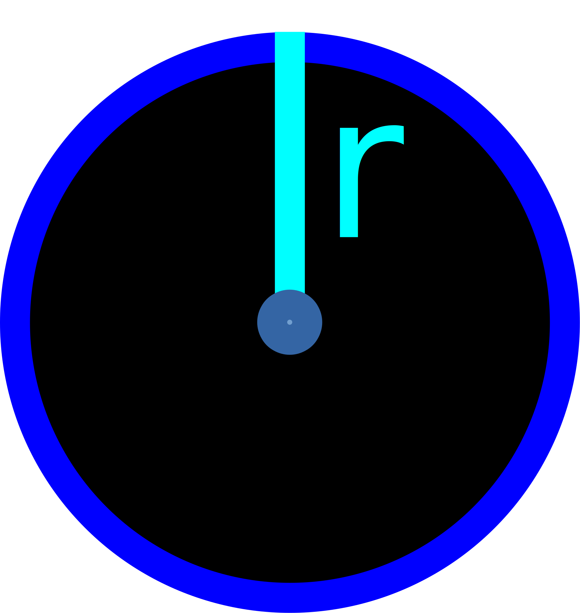

# Geometry

## Rectangle

[rectangleArea](rectangle/rectangleArea.js)  

[rectanglePerimeter](rectangle/rectanglePerimeter.js)  

# Circle

[circleAreaFromRadius](circle/circleAreaFromRadius.js)  

  

---

[circleAreaFromCircumference](circle/circleAreaFromCircumference.js)  

  

---

[circleAreaFromDiameter](circle/circleAreaFromDiameter.js)  

  

---

//----//

// Dedicated to God the Father  
// All Rights Reserved Christopher Andrew Topalian Copyright 2000-2025  
// https://github.com/ChristopherTopalian  
// https://github.com/ChristopherAndrewTopalian  
// https://sites.google.com/view/CollegeOfScripting

